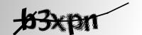
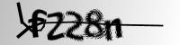
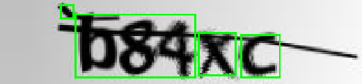
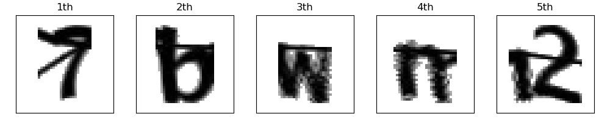
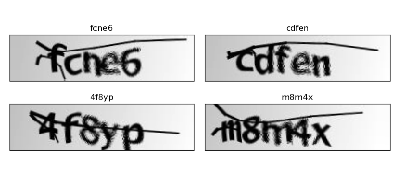
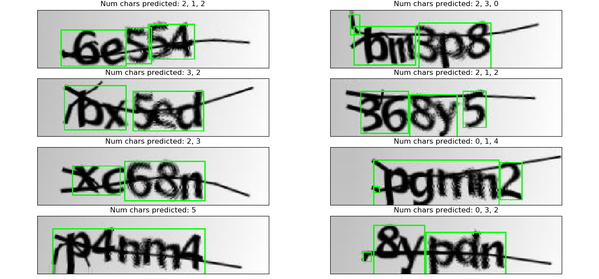
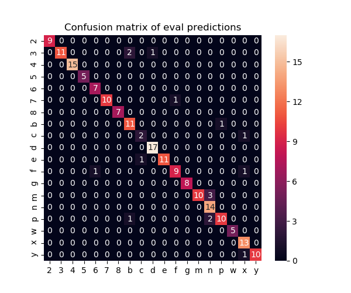
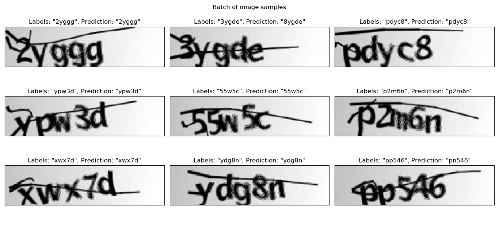

## Introduction
This project is intented to create a model that predicts words inside captcha images  <br/>

## Dataset
The dataset its avaliable on Kaggle: https://www.kaggle.com/fournierp/captcha-version-2-images <br/>

I also uploaded on floydhub: https://www.floydhub.com/vykstorm/datasets/captcha <br/>
It contains 1000+ captcha gray images (50x200), some of them with noise





## The model

The model i built make this steps to predict the words inside  images: <br/>

-Process the image and detect contours using OpenCV



-With the information provided by the contours, split the image in frames where each will contain a single character of the captcha text



- Then Run a convolutional neuronal network (CNN) created with Keras on each character to classify them

## Installation

Download first this repository on your local machine
```
git clone https://github.com/Vykstorm/CaptchaDL
cd CaptchaDL
```

Then you need to install dependencies of the proyect.
You can install anaconda and create a virtual environment using the dependencies file 'environment.yml' like this:
```
conda env create create -f=environment.yml
```
And later activate the virtual environment to run any script
```
conda activate captcha-dl
```

If you dont have anaconda, you can intall dependencies via pip using requeriments.txt:
```
pip install -r requeriments.txt
```

Then download the dataset from https://www.floydhub.com/vykstorm/datasets/captcha or https://www.kaggle.com/fournierp/captcha-version-2-images
and unzip it on the root directory. Then rename it to 'data'

You can also put the dataset in any location but you will need to change the file configuration models/config/dataset.conf and change
DATASET_DIR variable


## Running scripts

A couple of scripts are provided in the directory models/

The next code will print information relative to the dataset
```
cd models
python dataset.py
```
```
attr                                           
Dataset directory                      ../data/
Number of samples                          1070
Image dimensions                   (50, 200, 1)
Number of chars per captcha image             5
Number of char classes                       19
```

Run ```python input.py``` to visualize the dataset images




Run ```python contours.py``` to see how contours are extracted from the images



Execute ```python chars.py``` to check how characters in the images are detected


Also the script char_classifier.py provides a CLI to train/evaluate the convolutional neuronal network that classifies individual characters extracted from images

```
python char_classifier.py --help
```

Execute the next line to quickly evaluate it
```
python char_classifier.py -v --eval --num-samples 200
```

Accuracy score & confusion matrix will be displayed




Finally, run ```python ocr.py``` to test the whole system. a window will be popped up and will show a few predictions.



Also different score metrics will be printed on stdout.
Check the docs in the script models/metrics.py to know what each metric means.
